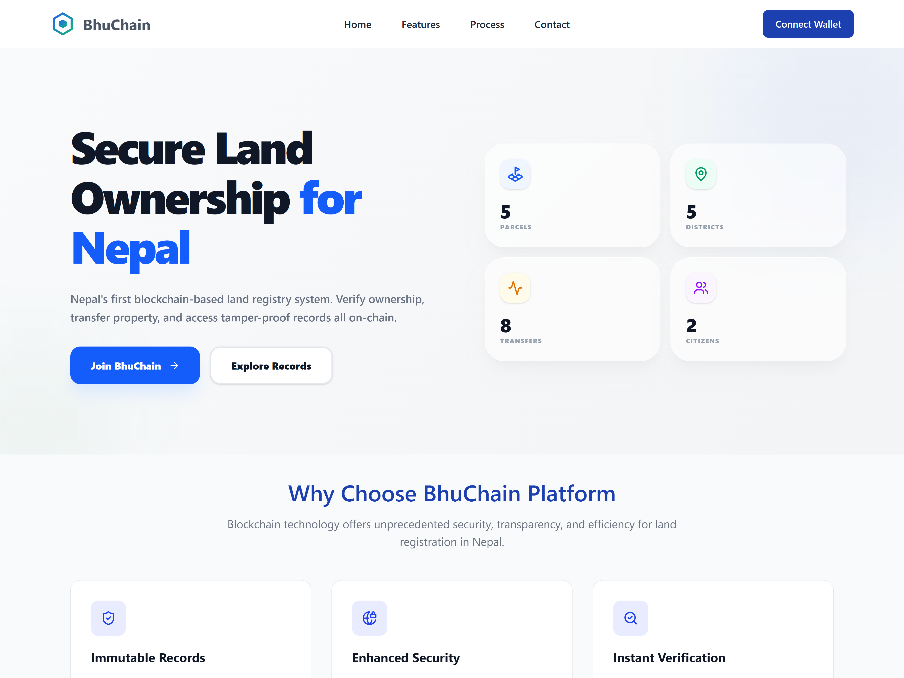
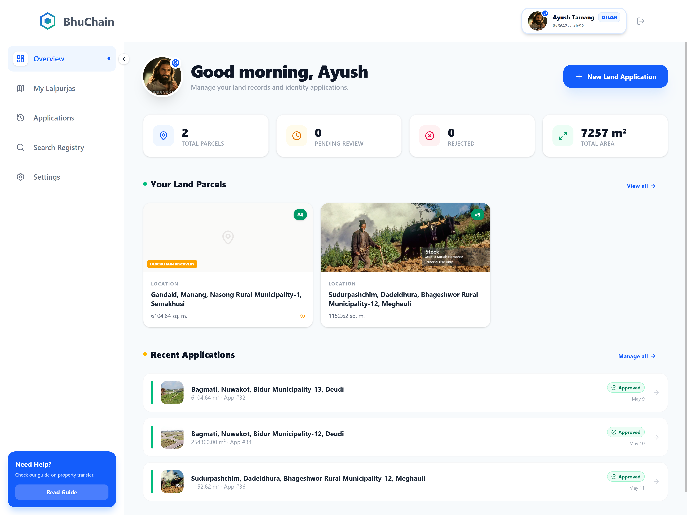
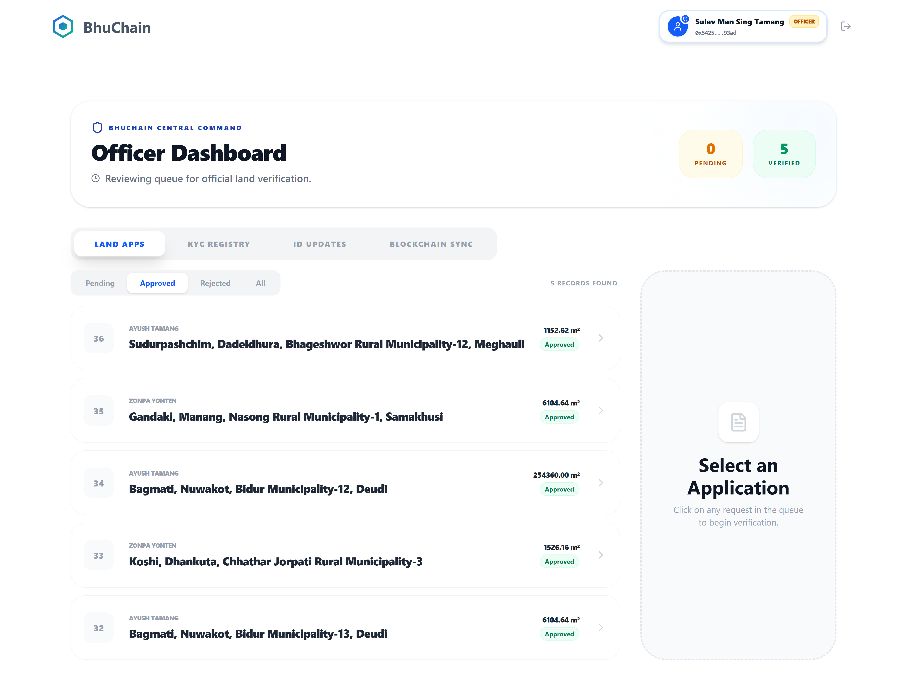
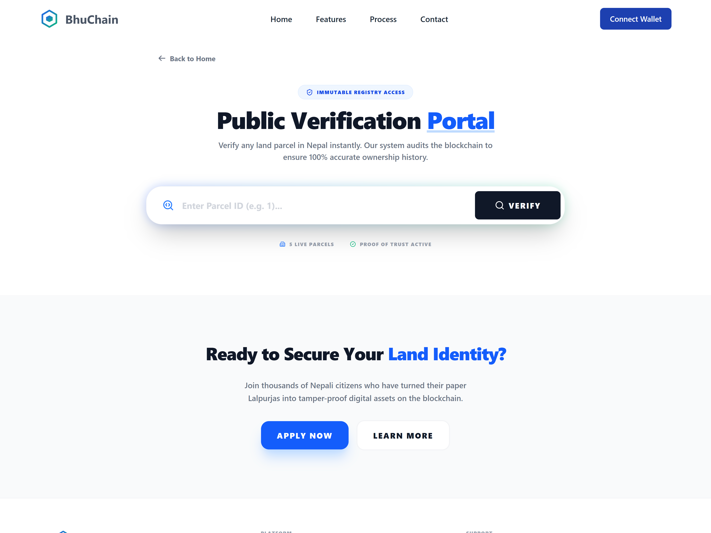

<div align="center">

# BhuChain
### Hybrid Blockchain Land Registry System

[](https://opensource.org/licenses/MIT)
[](https://reactjs.org/)
[](https://www.djangoproject.com/)
[](https://soliditylang.org/)



</div>

---

Land fraud is a real and persistent problem in Nepal. Records get tampered with, documents get forged, and citizens have no reliable way to verify who actually owns a piece of land. BhuChain was built to fix that.

The idea is straightforward: put the ownership records on a blockchain where nobody — not even a system admin — can quietly edit or delete them. At the same time, running everything purely on-chain is slow and expensive for day-to-day use, so a Django backend with a PostgreSQL database handles the fast queries and administrative workflows. The two layers stay in sync through an event-driven synchronization engine.

---

## How It Works

The core architecture is a hybrid between Web2 and Web3:

```
                        User (Citizen or Officer)
                               |
               ┌───────────────┴───────────────┐
               |                               |
        Django REST API                Ethereum Sepolia
        + PostgreSQL DB    <-- Sync -->  (ERC-721 Contract)
        (Fast queries)       Engine     (Source of truth)
```

When a property is registered, it gets minted as an ERC-721 NFT on the Ethereum Sepolia testnet. That record is permanent. The Django backend listens for on-chain events and mirrors the data locally so searches and dashboard queries stay fast. If the off-chain data ever gets corrupted or deleted, the blockchain record is always there to recover from.

Authentication works through MetaMask using Sign-In With Ethereum (SIWE / EIP-4361). There are no passwords anywhere in the system.

---

## Features

**Immutable records** — Each land parcel is an NFT. Ownership history is written to the blockchain and stays there permanently.

**QR verification** — Every digital deed has a QR code that points to the Etherscan entry for that parcel. A bank, lawyer, or court can verify ownership independently without trusting this system at all.

**Property locking** — If a parcel is under legal dispute, an authorized officer can lock the token on-chain. This blocks any transfer transaction from going through until the lock is lifted.

**Passwordless auth** — Login is handled entirely through wallet signatures. No accounts, no passwords, no password reset flows.

**Dual-sync engine** — A background process listens to blockchain events in real time and keeps the PostgreSQL database consistent with what's on-chain.

---

## Screenshots

**Citizen Dashboard** — Citizens can view their registered land parcels, track application status, and submit new registration requests.



---

**New Land Application** — The registration form collects parcel details in traditional Nepali units (Ropani, Aana, Paisa, Damm) and accepts a scan of the physical Lalpurja deed.


---

**Officer Dashboard** — Officers review incoming applications, manage KYC, monitor the blockchain sync status, and approve or reject registrations before minting.



---

**Public Verification Portal** — Anyone can look up a parcel by ID without logging in. Useful for banks, lawyers, or buyers who want to confirm ownership before a transaction.



---

**Certificate of Ownership** — Each approved parcel generates a formal certificate containing the owner's name, registered address, area, blockchain hash, and a QR code for on-chain verification.


---

## Tech Stack

| Layer | Technology |
|---|---|
| Smart Contract | Solidity `^0.8.28`, ERC-721, Hardhat |
| Network | Ethereum Sepolia Testnet |
| Web3 Client | Ethers.js v6, MetaMask (SIWE) |
| Backend | Python, Django 5, Django REST Framework |
| Database | PostgreSQL 16 |
| Frontend | React 19, Vite, Tailwind CSS v4 |

---

## Project Structure

```
BhuChain/
├── blockchain/
│   ├── contracts/
│   │   └── BhuChain.sol        # Core ERC-721 smart contract
│   ├── ignition/               # Hardhat Ignition deployment modules
│   ├── scripts/                # Utility scripts
│   └── test/                   # Contract unit tests
│
├── backend/
│   ├── bhuchain_backend/       # Django project settings
│   └── registry/               # Models, views, serializers, sync engine
│
└── frontend/
    └── src/
        ├── pages/              # CitizenDashboard, OfficerDashboard, SearchRegistry...
        ├── components/         # Reusable UI components
        ├── context/            # Auth and wallet context
        ├── hooks/              # Custom React hooks
        └── services/           # API and blockchain service layers
```

---

## Setup

### Prerequisites

- Node.js v18+
- Python 3.11+
- PostgreSQL 16+
- MetaMask browser extension
- Sepolia testnet ETH (from any public faucet)

### 1. Smart Contracts

```bash
cd blockchain
npm install
cp .env.example .env
# Fill in PRIVATE_KEY, SEPOLIA_RPC_URL, ETHERSCAN_API_KEY

npx hardhat compile
npx hardhat ignition deploy ./ignition/modules/BhuChain.ts --network sepolia
```

### 2. Backend

```bash
cd backend
python -m venv env
env\Scripts\activate        # Windows
# source env/bin/activate   # macOS / Linux

pip install -r requirements.txt
cp .env.example .env
# Fill in DATABASE_URL, CONTRACT_ADDRESS, DJANGO_SECRET_KEY

python manage.py migrate
python manage.py runserver
```

### 3. Frontend

```bash
cd frontend
npm install
cp .env.example .env
# Fill in VITE_API_BASE_URL, VITE_CONTRACT_ADDRESS

npm run dev
```

App runs at `http://localhost:5173`.

---

## Environment Variables

Each sub-project has an `.env.example` listing what's needed. Never commit real `.env` files.

| Variable | Where | What it's for |
|---|---|---|
| `PRIVATE_KEY` | `blockchain/.env` | Deployer wallet private key |
| `SEPOLIA_RPC_URL` | `blockchain/.env` | Alchemy or Infura Sepolia endpoint |
| `DATABASE_URL` | `backend/.env` | PostgreSQL connection string |
| `CONTRACT_ADDRESS` | `backend/.env` | Deployed contract address |
| `VITE_CONTRACT_ADDRESS` | `frontend/.env` | Same address, used on the frontend |

---

## Author

**Sulav Man Sing Tamang**
- GitHub: [@sulavtamang](https://github.com/sulavtamang)
- LinkedIn: [Sulav Man Sing Tamang](https://www.linkedin.com/in/sulav-man-sing-tamang-269bb5190/)

---

MIT License. See [`LICENSE`](./LICENSE) for details.
